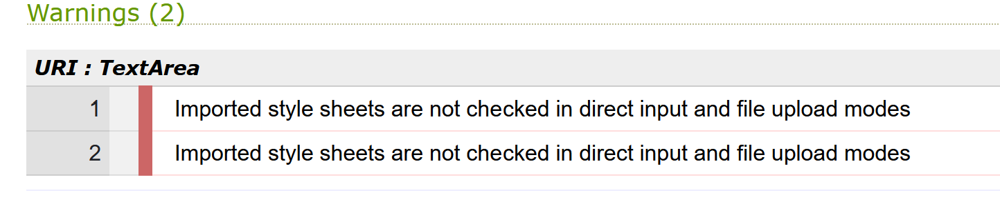

---

# *Paw Walkers*

The Paw Walkers website allows people to learn about the company "Paw Walkers" and find sitters for dogs and cats. The visitors of the website could quickly search and contact the person to care them's pet.

The site can be accessed by this link: https://nikolettagr.github.io/Project1-Paw-Walkers/

---
## User Stories

### First Time Visitor Goals:
 * As a First Time Visitor, I want to easily understand the main purpose of the site, so I can learn more about the organization.
 * As a First Time Visitor, I want to be able to easily navigate through the website, so I can find the content.
 * As a First Time Visitor, I want to see the testimonials, so I can see whether the organization is trustworthy.

### Returning Visitor Goals:
 * As a Returning Visitor, I want to see various pet sitters, so that I can choose from.
 * As a Returning Visitor, I want to find a way to get in contact with the organization, so that I can ask additional questions or send a request about a particular sitter.
 * As a Returning Visitor, I want to find community links, so that I can learn more about the organization.

### Frequent Visitor Goals:

 * As a Frequent User, I want to have options for the reason to contact the company, so I can get an explicit answer to my email.

## Features

+ ## Navbar

+ ##### Navigation

    -Positioned at the top of the page.

    -Contains logo of the company on the left side.

    -Contains navigation links on the right side:
      * HOME - leads to the home page where users can learn about the company Paw Walkers and there is a dropdown options with sections ABOUT US, SERVICES and CONTACT.
      * ABOUT US - leads to about us section where users can learn about how is working the company.
      * SERVICES -leads to services section where users can see all services which we offer.
      * GALLERY - leads to the gallery page where users can see sitter experiences and images.
      * CONTACT - leads to  the contact section where useres can get touch with the company.
      * BOOKING - leads to the booking form page where users can fill out the form in order to get in touch with sitters and book them.

    -The links have hover effect.
    -The navigation is clear and easy to understand for the user.

    

    -The navigation bar is responsive:

    - On tablets:
      Navigation bar is split into one line: the first line filled with the logo and the second line filled with links. All elements are centered.

    

    - On mobile devices: 
      Navigation bar is split into to lines: the first line filled with the logo and the second line filled with links. All elements are centered.

    

---

+ ### Home Page

    - Represent: 

    * the main idea of the company.
    * Emphasize the strong points of the company.
    * Offering services.
    * Invites to fill out the booking form.      

    

---

+ #### Main Section

    - Main section have a fixed background image.

    - Main section have the block section below the   image that consist:

     * Welcome message.
     * Short quote about dogs.
     * Button that leads directly to the booking page.

    

---
+ #### About Us Section

    - About Us section has 4 cards with strong descriptive characteristics of the company.
    - Tells website visitors about safety.
    -Attracts viewers to use this company for caring them's pets.

    

---
+ #### Services Section

    - Services section is about offering services which the company has.
    - Each service is described clearly with logo.

    

---
+ #### Contact Section

    - Contact section has informations about company's address, phone number and email.
    - Visitors can check the opening hours of the office.
    - Visitors can check the address on google maps.

    
    

---
+ #### Footer

    - Footer contains social media links that open in a new tab and the website author's name.

    

---
+ ### Gallery Page
    
    - Gallery page has testimonials from people who were satisfied with the company's service.
    - Each card has a picture of an animal with its owner.
    - Each card has a story from the people who had an experience of using the Paw Walkers.
    - Each card has a name of the pet's owner.
    -It has a button after the cards that leads to more testimonials and stories website.
    -It has a footer identical to the home page's footer.

     

---
+ ### Booking Page 

 - Contact page has a contact form:

    - It has two checkboxes for the visitors to fill:
                  
        * The 1st is - DOG
        * The 2nd is - CAT

     - All text input fields are customized.
     - Labels are animated when the input field is in focus and are not empty.
     - All inputs are set to be required to fill out.
     - The submit button is animated on hover.
     -It has a footer identical to the home page's footer.

---
+ ### Response page

   - Response page appears after submitting the booking form.
   - It contains the thank you message and the promise to send email with all details about booking.
   - It will automatically direct the user to the main page in 10 seconds.

    

 ---
## Technologies Used

- [HTML](https://developer.mozilla.org/en-US/docs/Web/HTML) was used as the foundation of the site.
- [CSS](https://developer.mozilla.org/en-US/docs/Web/css) - was used to add the styles and layout of the site.
- [CSS Flexbox](https://developer.mozilla.org/en-US/docs/Learn/CSS/CSS_layout/Flexbox) - was used to arrange items simmetrically on the pages.
- [CSS Grid](https://developer.mozilla.org/en-US/docs/Web/CSS/grid) - was used to make "gallery" and "contact" pages responsive.
- [Balsamiq](https://balsamiq.com/) was used to make wireframes for the website.
- [VSCode](https://code.visualstudio.com/) was used as the main tool to write and edit code.
- [Git](https://git-scm.com/) was used for the version control of the website.
- [GitHub](https://github.com/) was used to host the code of the website.
     

---
## Design

### Color Scheme

- Green color was used for logo , navigation links and buttons.It associated with trustworthiness, safety and calming attributes.
- Light grey was used for  the background of the page
- White was used also for background ,cards and header.White is generally considered a neutral backdrop that lets other colors in a design have a larger voice.Gray backgrounds are very common, as is gray typography.

### Typography

- Exo Google Font was used as the main font of the website in order to increase readability of the content on the pages.

- Belanosima was used to attract viewer's attention to the company's logo, to make an accent on the strong points of the company, and to incentivize visitors to contact "Paw Walkers".

### Wireframes

---
## Testing

In order to confirm the correct functionality, responsiveness, and appearance:

+ The website was tested on the following browsers: Chrome, Firefox, Brave.

  - Chrome:

    

  - FireFox:

    

  - Brave:

    

+ The website was checked by devtools implemented in Firefox and Chrome browsers.

  - Home Page:

    

  - Gallery Page:

    

  - Booking Page:

    

  - Response Page
    
    

+ The functionality of the links in the website was checked as well by different users.

### Manual testing

| feature | action | expected result | tested | passed | comments |
| --- | --- | --- | --- | --- | --- |
| Navbar | | | | | |
| Home | Click on the "Home" link | The user is redirected to the main page | Yes | Yes | - |
| Gallery | Click on the "Gallery" link | The user is redirected to the gallery page | Yes | Yes | - |
| Contact | Click on the "Contact" link | The user is redirected to the contact section | Yes | Yes | - |
| About Us | Click on the "About Us" link | The user is redirected to the About Us section | Yes | Yes | - |
| Services | Click on the "Service" link | The user is redirected to the services section | Yes | Yes | - |
| Footer | | | | | |
| Instagram icon in the footer | Click on the Instagram icon | The user is redirected to the Instagram page | Yes | Yes | - |
| Facebook icon in the footer | Click on the Facebook icon | The user is redirected to the Facebook page | Yes | Yes | - |
| Twitter icon in the footer | Click on the Twitter icon | The user is redirected to the Twitter page | Yes | Yes | - |
| Home page | | | | | |
| "Find your pet sitter now" button in Hero_main section | Click on the "Find your pet sitter now" button | The user is redirected to the booking page | Yes | Yes | - |
| Gallery page | | | | | |
| Image in the gallery | Yes | - |
| "More stories" button in gallery page | Click on the "More stories" button | The user is redirected to the testimonials and feedback page | Yes | Yes | - |
| Booking page | | | | | |
| Dog and Cat checkbox | Click on the checkbox | The checkbox is checked | Yes | Yes | These checkboxes are not required as the user can choose which kind of pet need a care |
| First name input | Enter the first name | The first name is entered | Yes | Yes | If user doesn't enter the first name, the error message appears |
| Email input | Enter the email | The email is entered | Yes | Yes | If user doesn't enter the email, the error message appears. If user enters not valid email, the error message appears |
| "Book" button | Click on the "Book" button | The user is redirected to the response page | Yes | Yes | - |

---
## Bugs
+ ##### Solved Bugs
  - I had additional margins and paddings which I fixed quiqly.
  - I had issues with navigation bar because I didn't specified display.
  - I had issues with media queries for mobile phones, but I managed them quiqly.

+ ##### Unsolved bugs
  - None.

+ ##### Mistakes
  - Mistakes were made while committing changes. I didn't specifize the file's name.
  - While progressing in my code I learned to use present simple tense in commits.

## Validator testing
+ ### HTML
  #### Home Page
    - No errors or warnings were found when passing through the official W3C validator.

    
    
  
  #### Gallery Page
    - No errors or warnings were found when passing through the official W3C validator.

    

  
  #### Booking Page
    - No errors or warnings were found when passing through the official W3C validator.
     
    

  
  #### Response Page
    - No errors or warnings were found when passing through the official W3C validator.

    

+ ### CSS
  No errors or warnings were found when passing through the official W3C (Jigsaw) validator except:
    
    - 2 errors for imported style sheets.
    - Even though this error is present, I don't understand why, while testing on different browsers they are working good.

    
    

    

+ ### Lighthouse
    
  #### Home page

  

  
  #### Gallery page

  

   - I am aware that the performance not so good and I will fix it in the future, as I didn't have enough time.

  
  #### Booking page

  

  #### Response Page

  

   - I am aware that the performance not so good and I will fix it in the future, as I didn't have enough time.

---
## Deployment

- The site was deployed to GitHub pages. The steps to deploy are as follows: 
  - In the [GitHub repository](https://github.com/NikolettaGr/Project1-Paw-Walkers), navigate to the Settings tab 
  - From the source section drop-down menu, select the **Main** Branch, then click "Save".
  - The page will be automatically refreshed with a detailed ribbon display to indicate the successful deployment.

The live link can be found [here](https://nikolettagr.github.io/Project1-Paw-Walkers/)

## Local Deployment

In order to make a local copy of this project, you can clone it.
In your IDE Terminal, type the following command to clone my repository:

- `git clone https://github.com/NikolettaGr/Project1-Paw-Walkers.git`

---
## Future improvements

- add favicon with [Favicon Generator. For real.](https://realfavicongenerator.net/);
- add custom 404 page;
- add accessability report with [WAVE Web Accessibility Evaluation Tool](https://wave.webaim.org/);
- improve the quality of the commit messages (I am aware that some of them are not very clear and not meeting the standards and will improve them in the future);
- add fully functional booking form when I get enough knowledge in building websites;

---
+ #### Media

- All the images for the website were taken from [Pexels](https://www.pexels.com/).

+ #### Tools

    - [Compress JPEG](https://compressjpeg.com/) was used to compress JPEG images.
    - [EzGif](https://ezgif.com) was used to resize GIF images.
    - [cooler](https://coolors.co/) was used to create the color palette.

---
## Acknowledgments

- [Iuliia Konovalova](https://github.com/IuliiaKonovalova) was a great supporter of another bold idea of mine for this project. Julia guided me through the development of the project and helped me to learn a lot of new things by challenging me to do something new.
- [Code Institute](https://codeinstitute.net/) tutors and Slack community members for their support and help.
- [Kevin Powell](https://www.youtube.com/user/KepowOb) for his amazing CSS tutorials.

---
